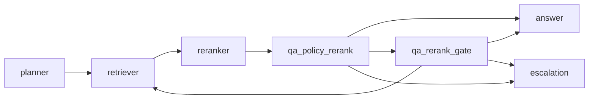
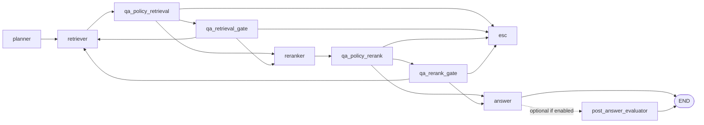

# RAG agent architecture — refactoring plan (review follow-up)

**Status:** Approved — **v2 + hardening** (see [§6 Decision log](#6-decision-log))  
**Last updated:** April 16, 2026  
**Related:** [`rag-system-development-plan.md`](./rag-system-development-plan.md) (product phases, Bedrock, API); [`rag-architecture-execution-plan.md`](./rag-architecture-execution-plan.md) (ordered PRs: renames, facade, offline/online boundaries). This document focuses on **orchestration quality**, **policy robustness**, and **scope control** (v1 vs v2).

**Audience:** Engineering for implementation order; v1 remains a **documented alternative**, not the current ship target.

---

## 1. Goals

| Goal | Why |
|------|-----|
| **Reduce brittleness of score-only policy** | Embedding/rerank scores are not calibrated; thresholds drift with corpus and model changes. |
| **Make context assembly explicit** | Token budget, deduplication, and ordering should be owned and testable—not an accident of “whatever the reranker returned.” |
| **Clarify planner responsibilities** | As prompts grow, a single “planner” becomes hard to debug; structured outputs enable evals and safer iteration. |
| **Invest in evaluation before more graph nodes** | Reliability gains usually come from benchmarks + traces first, then architecture. |
| **Define v1 vs v2** | Document both shapes; **approved path is v2 + hardening** with HITL/compliance retained (see §6). |

Non-goals for this plan document: replacing LangGraph, choosing Bedrock vs local (covered in the development plan), or specifying the HTTP API contract (still lock separately).

---

## 2. Review issues → planned responses

| Concern | Response (summary) | Track |
|--------|-------------------|--------|
| Score-based policies are fragile | Treat scores as **ordinal signals**; add **monitoring**; optional **hybrid** (heuristic + small LLM “sufficiency” probe); document **calibration** approach (held-out set / percentile bands—not raw thresholds as probabilities). | Phase A–B |
| Double gate (retrieval → rerank) may be redundant | **Keep both gates** (HITL/compliance). Continue to **measure** (latency, $, HITL rate, escalation rate); a **v1** single-gate variant remains a documented option if metrics later justify it. | **Decided:** keep v2 gates |
| Missing explicit context construction | Introduce a **context builder** contract: select/dedupe/order/trim to budget; callable from answer path; unit-tested. May stay **inside** `answer_node` initially—**named module + tests** matters more than a new LangGraph node. | Phase A |
| Planner under-specified | **Structured outputs**: mode + optional `intent`, `retrieval_hints`, task fields—Pydantic models already fit; extend schema and tests before adding more behavior. | Phase A |
| No memory / session learning | **Out of v1.** v2 **optional**: opt-in session summary, failure-pattern hints—only with privacy/product sign-off. | Phase C (optional) |
| Task path too linear | **Out of v1.** v2: edge from scheduler/confirm back to `clarify` when product requires mid-flow clarification. | Phase C (optional) |
| Answer evaluator before END | **Optional** in v2: **post-answer evaluator** node or step behind config—**default off** (`false`) until explicitly enabled; avoids extra LLM cost in the hot path by default. | Phase B–C (impl when prioritized) |

---

## 3. Phased refactoring (implementation order)

### Phase A — Foundation (do first; low graph churn)

**Implemented in repo (April 2026):** `app/graph/context_builder.py`, extended `PlannerOutput` + state, structured policy logging in QA policy nodes, `docs/rag-score-policy.md`, tests in `tests/test_context_builder.py` / `test_hybrid_policy.py` / routing.

1. **Context builder module**  
   - Input: ranked chunks + config (`max_tokens` or char budget, dedup strategy, max chunks).  
   - Output: string block + list of chunk ids used (for citations alignment).  
   - Wire from `answer_node` (and keep `schemas` / formatting consistent).  
   - Tests: budget enforcement, dedup, empty input.

2. **Planner output schema**  
   - Extend structured fields (e.g. `intent`, optional `retrieval_hints` or `sub_intent`) without changing routing until validated.  
   - Golden tests + evals on planner outputs if LLM planner enabled.

3. **Observability for policy decisions**  
   - Log: raw scores, thresholds, route chosen, **reason codes** (already partly present—ensure stable enums for dashboards).

4. **Eval / regression harness expansion**  
   - Scripted scenarios: empty retrieval, adversarial query, low score, refine loop, escalation.  
   - Tie to existing `evals/` where possible.

**Exit criteria:** Context builder in use; planner schema versioned; baseline eval suite green on main.

### Phase B — Policy hardening

**Implemented in repo (April 2026):** `RAG_POLICY_MODE` / `RAG_POLICY_HYBRID_BORDER_LOW`, `app/graph/hybrid_policy.py` + probe chains in `app/rag/generator/llm.py`, `RAG_POST_ANSWER_EVALUATOR` + `post_answer_evaluator` graph node (`app/graph/nodes/post_answer_node.py`), env docs in `.env.example`.

1. **Score policy documentation**  
   - Document that thresholds are **empirical**; process to re-tune when embedder/reranker/corpus changes.

2. **Hybrid policy spike (optional flag)**  
   - e.g. `RAG_POLICY_MODE=scores_only|hybrid`  
   - Hybrid: keep fast score gates; add **cheap** LLM check only on borderline band (define band by percentile or two-threshold “uncertainty zone”).

3. **Post-answer evaluator (optional; default off)**  
   - Add **wiring** (node or internal step after `answer_node`) + config, e.g. `RAG_POST_ANSWER_EVALUATOR=false` (exact name TBD in `app/core/config.py`).  
   - When **false**: no extra LLM call; graph behaves as today.  
   - When **true**: run evaluator (heuristic and/or LLM) and route to refine / escalate / END per product rules—document outcomes before enabling in prod.

**Exit criteria:** Clear policy modes; optional hybrid behind flag; post-answer flag documented (implementation may land in same phase or follow Phase A).

### Phase C — Further v2 enhancements (optional)

- Session memory / query-style hints (privacy-reviewed).  
- Task graph: clarify ↔ scheduler loop edges.  
- Deeper integration with LLM-as-judge / DataDog (aligns with development plan §5).  
- Batch-only judge flows if online post-answer stays off.

---

## 4. v1 vs v2 — architecture definitions

Use these labels in issues and PRs so scope does not creep.

### Approved product shape (this repo)

| Decision | Choice |
|----------|--------|
| **Graph** | **Stay on v2** — full path: retrieval policy + **retrieval HITL gate** + rerank policy + **rerank HITL gate** (HITL/compliance retained). |
| **Work focus** | **Harden:** Phase A–B (context builder, planner schema, score policy docs, optional hybrid flag, observability). |
| **Post-answer evaluator** | **Supported as an option; default `false`** until enabled (config + implementation when scheduled). |

### 4.1 v1 — “Thin reliable path” (documented alternative; not current target)

**Intent:** Minimize nodes and LLM calls in the hot path; rely on **strong evals**, **explicit context budget**, and **documented thresholds**. Useful if a future product slice wants a single post-rerank gate—**not** the approved direction for this plan.

| Aspect | v1 |
|--------|----|
| **Q&A flow** | `planner → retriever → reranker → qa_policy_rerank → answer \| qa_rerank_gate \| escalation` |
| **Retrieval HITL** | **Off by default** or policy routes **skip** retrieval gate (only auto-escalate or continue to rerank on scores). Equivalent: **merge** retrieval low-confidence path into “continue to rerank” when chunks exist. |
| **Rerank HITL** | **On** where product needs human override on weak answers (configurable). |
| **Policy** | Score + heuristic thresholds; **no** extra LLM policy step in the hot path. |
| **Context** | **Required:** context builder (budget + dedup + ordering). |
| **Planner** | Structured output (mode + minimal fields); keyword fallback unchanged. |
| **Learning** | None in-session. |
| **Task path** | Current linear flow acceptable (`clarify → scheduler → confirm → answer`). |

**Mermaid (v1 Q&A — conceptual)**

### 4.2 v2 — “Full decision graph + optional intelligence layers”

**Intent:** Keep or restore **full** exploratory behavior; add **optional** layers for reliability and UX when cost/latency are acceptable.

| Aspect | v2 |
|--------|-----|
| **Q&A flow** | **Both** `qa_policy_retrieval` and `qa_policy_rerank` with **qa_retrieval_gate** and **qa_rerank_gate** as today (or refined, not removed without data). |
| **Policy** | **Hybrid** optional: LLM sufficiency / borderline band; calibrated thresholds where available. |
| **Context** | Context builder + optional **summarization** of long context (extra LLM call—feature-flagged). |
| **Post-answer** | Optional **answer_evaluator** — implement behind config, **default off**; batch judge remains valid for evals when online path is off. |
| **Planner** | Richer structured outputs; possible multi-step task decomposition fields. |
| **Task path** | Loops back to **clarify** where needed; optional partial rollback (product-defined). |
| **Learning** | Optional session hints / failure patterns (privacy + consent). |

**Mermaid (v2 Q&A — matches current rich graph)**

*Default path: `answer → END`. When post-answer evaluator is **off**, ignore the dashed branch. When **on**, use `answer → post_answer_evaluator → END` (and define refine/escalate edges in implementation).*

### 4.3 How this maps to the codebase today

- **Current repo** matches **approved v2** (retrieval policy + retrieval gate + rerank policy + rerank gate).  
- **Hardening** does not remove gates; it adds **context builder**, **clearer policy semantics**, **evals**, and optional **hybrid** / **post-answer** flags.  
- **v1** remains a **documented** shrink path (routing shortcuts / compact graph) if priorities change later.  
- **Phase A** (context builder, planner schema, evals) applies directly to the approved v2 path.

**Layering glossary (logs and reviews):** use the same vocabulary as structured logs:

| Layer | Meaning | Typical scores / state |
|-------|---------|-------------------------|
| **Candidate retrieval** | Vector / keyword fetch + fusion (RRF) into graded chunks | Best **ensemble** score over `GradedChunk`s (see `retrieval_signal()` in `confidence_routing.py`; `policy.py` re-exports) |
| **Reranking** | Rescore / reorder candidates | `confidence_score` = top **rerank** relevance among `RankedChunk`s |
| **Confidence routing** | Threshold-based route: answer / HITL gate / escalate | After ensemble (`qa_policy_retrieval`) and after rerank (`qa_policy_rerank`) |
| **Context assembly** | Budget, dedupe, citation order | `context_builder` |

Canonical copy with PR sequencing: [`rag-architecture-execution-plan.md`](./rag-architecture-execution-plan.md) (§ Layering glossary).

---

## 5. Approval checklist

| Item | Status |
|------|--------|
| **Target ship shape** | **Approved:** **v2 + hardening** (not v1-first). |
| **Retrieval + rerank HITL gates** | **Approved:** **keep** for HITL/compliance. |
| **Hybrid LLM policy** | Optional flag; confirm cost/latency envelope **when** enabling. |
| **Post-answer evaluator** | **Approved:** add as **optional** capability; **default off** until enabled. |
| **Session learning** | Out of scope until privacy review. |
| **Eval benchmark owner** | Still assign (ties to development plan §4–5). |

---

## 6. Decision log

| Date | Decision | Rationale |
|------|----------|-----------|
| 2026-04-16 | **Stay on v2** and **harden** (Phase A–B), not a v1-first shrink. | Keeps full decision graph and dual HITL gates while improving context, policy clarity, and evals. |
| 2026-04-16 | **Keep** retrieval and rerank **HITL gates** (compliance / product trust). | Explicitly not folding to a single gate for now. |
| 2026-04-16 | **Post-answer evaluator:** implement as an **option**, **default false** (`off`). | Allows future reliability layer without extra LLM cost or latency until explicitly enabled. |
| — | (e.g. hybrid flag on/off in prod, exact env names) | Append as needed. |

---

## 7. Summary

- **Approved path:** **v2** graph (dual policy + dual HITL gates) + **hardening** (context builder, planner schema, observability, score policy docs, optional hybrid).  
- **Post-answer evaluator:** **on the roadmap** as an **optional** step, **default off** until config enables it.  
- **v1** (thin path) stays **documented** in §4.1 for future use—not the active refactor target.  
- **Session learning / task loops** remain Phase C / product-gated.

Engineering can turn §3 into tickets against the **v2 hardening** line; post-answer work is a **flagged** add-on when prioritized.
